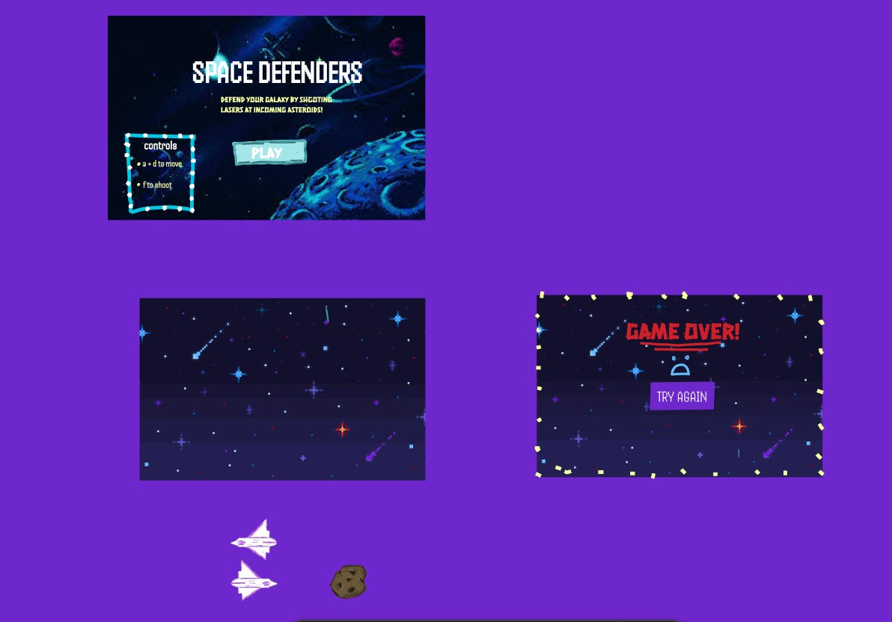

:warning: Everything between << >> needs to be replaced (remove << >> after replacing)

# Call of the Savannah  
## CS110 Final Project Fall, 2024 

## Team Members

Elizabeth Morgan 

***

## Project Description

IDEA 1: I will simulate a videogame where a player will have to run from a predator and evade obstacles by jumping. (score will be factored)

IDEA 2: I will simulate a videogame where a the player will be a bird trying to catch fish. (score will be Factored)
***    

## GUI Design
IDEA 1: -The playable character will be an antelope (impala).
^The user will be able to chose whether to play as a female or male impala. (thoughtful to user, what they prefer?)
- The background will resemble a savannah
-The obstacles that the player msut avoid are rocks
-The "predator" that is trailing the player is a leopard

IDEA 2: -The playable character will be a bird (crane) or may just do a seagull?
^ Fish will spawn in on the screen randomly (in the ocean)
- The background will show some land, with the sky and ocean
-Score will be at top of screen
### Initial Design

### Final Design

## Program Design

### Features
IDEA 1:
1. start menu 
2. moving obstacles 
3. choice of user to play which character
4. moveable character (jump + run) 
5. score keeping track 
6. easy/hard mode (speed of obstacles moving towards character)

IDEA 2:
1. start menu
2. fish spawning randomly
3. easy/hard mode (# of fish spawn, and speed)
4. moveable character?
5. score keeping track

### Classes

- << You should have a list of each of your classes with a description >>
IDEA 1:
-player
-user will chose to play as a female or male impala
-Leopard  (I may discard the leopard.  I am not sure how I would have it chase the impala (because i imagine the impala would essentially be stationary and its just trying to jump over the rocks going towards it?) 
-Obstacles (rocks moving on the screen)
-Score (score will change as the game lasts longer)
-Ground (character is running on ground)
IDEA 2:
-player
^user will play as a moveable crane or seagull (still deciding)
-Fish 
^fish will spawn in on screen randomly
-Score
^score will change as # of fish are caught and as game lasts longer

## ATP

| Step                 |Procedure             |Expected Results                   |
|----------------------|:--------------------:|----------------------------------:|
|  1                   | Run Counter Program  |GUI window appears with count = 0  |
|  2                   | click count button   | display changes to count = 1      |
etc...
