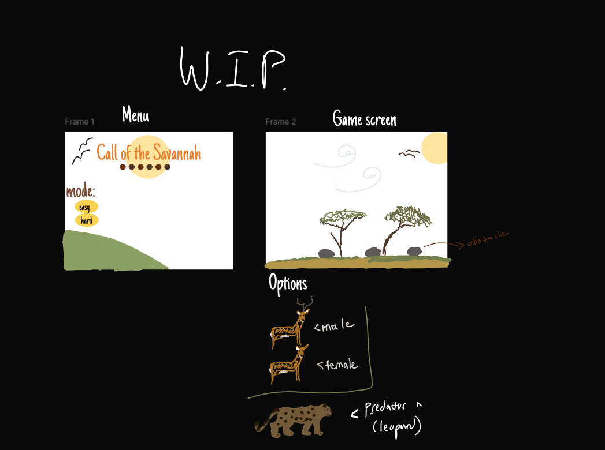

# Space Defenders  
## CS110 Final Project Fall, 2024 

## Team Members

Elizabeth Morgan 

## Project Description

This project is a videogame made using pygame, in which the player controls a space ship and shoots lasers to destroy incoming asteroids. Everytime an asteroid is destroyed, a point will be added to the score. If the asteroid hits the ship, then it will switch to the game over screen with an option to try again.

  

## GUI Design
The menu screen will contain the title, brief description of game, controls, and play button. The game screen contains a space background and the spaceship and asteroid both have drawn images to represent them. The game over screen has a space background with the score and try again button displayed.

### Initial Design

### Final Design

## Program Design

### Features
1. start menu
2. game screen
3. moveable character (space ship, moves left and right)
4. obstacle collisions (laser and asteroid) 
5. obstacle collisions (spaceship and asteroid)
6. game over screen
7. score keeping count

### Classes

Asteroid : Moves across screen, able to collide with laser and spaceship

Laser: red rectangle widget that shoots out from spaceship

Spaceship : Player controls this, starts in middle, can move left/right, shoot lasers

## ATP
Test Case 1: Menu button functioning
Test description: Verify that the button on menu screen works.
Test steps: 
1. Menu screen is displayed 
2. User clicks on play button
3. Verify that menu screen turns to game screen with the widgets
Expected outcome: The menu screen will switch to game screen in response to the button click.

Test Case 2: Spaceship Movement
Test description: verify that space ship moves left and right
Test steps:
1. Click play button
2. Menu screen switches to game screen
2. Press a or d keys
3. Verify that spaceship will move left and right
Expected outcome: The player's spaceship should move left and right in response to arrow key inputs

Test Case 3: Asteroid movement
Test description: Verify that the asteroid moves on game screen properly and resets when needed.
1. Click play button
2. Menu screen switches to game screen
3. Asteroids randomly spawn on edge of screen
4. Asteroids will move towards middle of screen and keep moving
5. Asteroids will dissapear and reset if it collides with laser
Expected outcome: Asteroid will move on screen correctly and reset if collision with laser occurs.

Test case 4: Game over condition
Test description: Verify that the menu screen switches to game over screen when certain conditions occur
1. Click play button
2. Menu screen switches to game screen
3. If space ship collides with asteroid, then the game screen switches to game over screen
4. "Game over" words are displayed, and final score is shown.
Expected outcome: When asteroid collides with spaceship, menu screen will switch to game over screen

Test case 5: Laser mechanic
Test description: Verify that laser shoots out of spaceship and collides with asteroid
1. Click play button
2. Menu screen switches to game screen
3. When f is clicked, a red rectangle representing the laser will shoot out from spaceship
4. IF laser collides with asteroid, a point is added to score
Expected outcome: Laser will shoot out from spaceship when f key is clicked